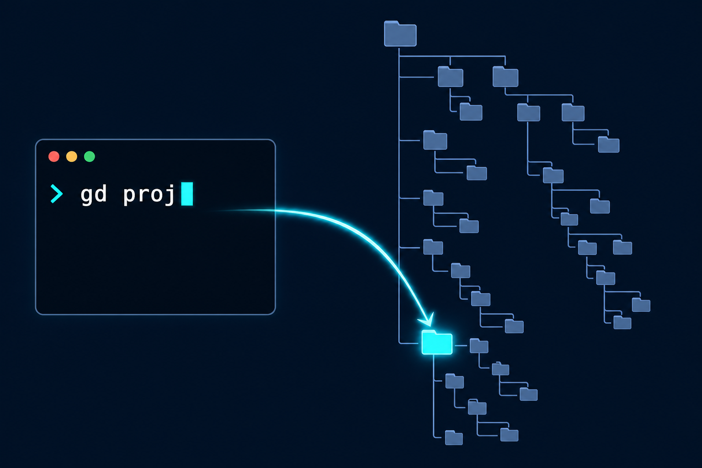
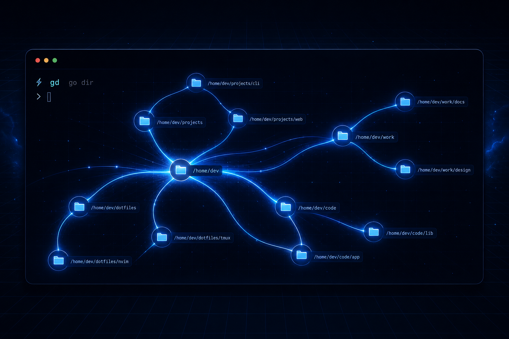
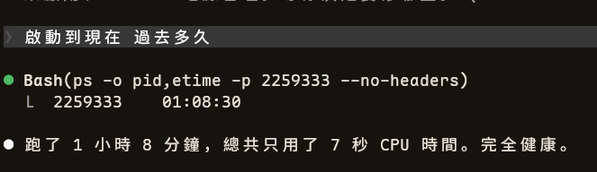

<div align="center">


# gd

**g**o **d**ir — 更好的 `cd`。

`gd >= cd`

[](LICENSE)
[](https://www.rust-lang.org/)
[](#shell-支援)

[English](README.md) | [繁體中文](README.zh-TW.md)

打個名字，直達目錄。不用記路徑，不用動腦。



</div>

---

## 為什麼用 gd？

| | `cd` | `gd` |
|---|---|---|
| 本地目錄 | `cd src` | `gd src` |
| 回家 | `cd` | `gd` |
| 上一個目錄 | `cd -` | `gd -` |
| 完整路徑 | `cd /tmp` | `gd /tmp` |
| 模糊搜尋 | - | `gd conf` |
| 歷史排名 | - | `gd proj`（記住你的選擇） |
| 快捷鍵 | - | `gd link k ~/code/kernel` |
| 加權目錄 | - | `gd boost ~/work` |

`cd` 能做的全部包辦，再加上智慧搜尋。

## 使用場景

**手機 SSH + AI 寫程式**

你人在外面，只有手機，SSH 連上遠端主機。在觸控鍵盤上打 `/home/deploy/projects/myapp-backend/src` 是一種折磨。用 gd：

```bash
gd myapp        # 你記得名字就夠了，不用記路徑
claude           # 開 Claude Code 開始寫
```

只有模糊印象？夠用了，gd 找得到。上次選過？它已經排在第一位了。

**深層專案目錄**

Monorepo 有 200 個 package，微服務散落在 `/opt`、`/srv`、`/home`。你不需要記住每個路徑 — gd 幫你記：

```bash
gd auth-service  # 不用管它在哪
gd payments      # 上週選過？還是排第一
```

**丟掉檔案管理器**

不用 SSH，就在你自己的電腦前。打開終端 — 然後再也不用開 Nautilus/Dolphin/Thunar。想找資料夾？打名字就好：

```bash
gd Downloads    # 不用再點檔案管理器的側欄
gd wallpapers   # 藏在 ~/Pictures/2024/wallpapers 裡？無所謂
gd taxes        # ~/Documents/finance/2025/taxes — gd 記得
```

搬檔案、複製、預覽，全部在終端搞定：

```bash
gd projects     # 跳到專案資料夾
ls              # 看看裡面有什麼
gd taxes        # 跳去稅務資料夾，抓個檔案
cp report.pdf ~/Desktop/
gd projects     # 一條指令就回來
```

設定 `alias cd=gd` 之後，終端就是你的檔案管理器。每個去過的目錄都會被記住並排名 — 用越多，敲越少。

**伺服器管理**

在 `/etc/nginx`、`/var/log/app`、`/opt/services/monitoring` 之間跳來跳去：

```bash
gd link ng /etc/nginx
gd link logs /var/log/app
gd ng           # 秒到
```

## 快速安裝

```bash
curl -sSL https://raw.githubusercontent.com/123hi123/gd/main/install.sh | bash
```

<details>
<summary>手動安裝</summary>

```bash
git clone https://github.com/123hi123/gd.git && cd gd
cargo install --path crates/gd-cli
cargo install --path crates/gd-daemon
gd setup
```

</details>

`gd setup` 一鍵搞定：

- 安裝 systemd daemon 服務
- 設定 `CAP_SYS_ADMIN` 權限
- 將 shell hook 寫入 rc 檔（`.zshrc`、`.bashrc` 等）
- 詢問是否要 `alias cd=gd`（推薦）

## 用法

```bash
gd                  # 回家目錄
gd src              # 當前目錄下有 ./src/？直接跳
gd config           # 沒有本地匹配？模糊搜尋，TUI 選擇
gd proj             # 選過的目錄？永遠排在最前面
gd /tmp             # 完整路徑？直接跳
gd ../lib           # 相對路徑？直接跳
gd -                # 回上一個目錄
```

**規則**：參數包含 `/` = 路徑模式（存在就跳，不存在就報錯）。不含 `/` = 搜尋模式。

## 排序策略

| 優先級 | 來源 | 說明 |
|---|---|---|
| 1 | **Link** | `gd link editor ~/code/editor` — 永久快捷鍵 |
| 2 | **選過的** | 透過 gd 選擇過的目錄，永遠高於未選過的 |
| 3 | **訪問過的** | cd 進去過的目錄，按最近訪問時間排序 |
| 4 | **索引** | daemon 背景掃描的檔案系統目錄 |

> **選過一次 > 從未選過**，無論匹配品質如何。

## 指令

```
gd <關鍵字>             搜尋並跳轉
gd link <別名> <路徑>   建立快捷鍵
gd unlink <別名>        移除快捷鍵
gd boost [路徑]         加權排名（預設：當前目錄，5 倍）
gd unboost <路徑>       移除加權
gd list                 顯示快捷鍵、加權、統計
gd clean                清除失效的條目
gd export               匯出資料庫（JSON）
gd doctor               檢查安裝狀態
gd setup                安裝 daemon + hook + cd 別名
gd update               重新編譯並重啟（開發者用）
```

## 架構



```
                    +-----------+
  gd <query> ----→ | gd (CLI)  | ----→ 輸出路徑 → shell cd
                    +-----------+
                         |
                    讀取 index + db
                         |
                    +-----------+
                    | gd-daemon | ← fanotify 檔案系統監聽
                    +-----------+
                         |
                    ~/.local/share/gd/
                    ├── index     (目錄清單)
                    └── db.json   (快捷鍵 + 歷史 + 加權)
```

**gd-daemon** 透過 Linux [fanotify](https://man7.org/linux/man-pages/man7/fanotify.7.html) 即時監聽檔案系統變化，目錄的建立、刪除、搬移都是增量追蹤——不需要定期全量掃描。

| | |
|---|---|
| 服務 | `~/.config/systemd/user/gd-daemon.service` |
| 權限 | `CAP_SYS_ADMIN` + `CAP_DAC_READ_SEARCH` |
| 記憶體 | ~45 MB |
| 查詢延遲 | < 25 ms |

> 運行 1 小時，CPU 僅用 7 秒——事件驅動，不輪詢。
>
> 

## Shell 支援

zsh、bash、fish、nushell、powershell — `gd setup` 自動偵測。

## 授權

MIT
